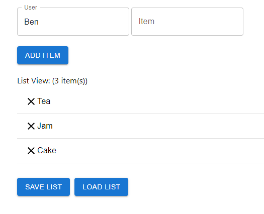

# React Redux Todo Demo App
This repo is a simple demo of how to make a rect todo app using redux for state management.

# Deployment
If you would like to deploy this I would suggest using AWS Amplify, it can be as simple as pointing Amplify to the repo.

# Getting Started with Create React App

This project was bootstrapped with [Create React App](https://github.com/facebook/create-react-app).

## Running

In the project directory, you can run:

### `npm start`

Runs the app in the development mode.\
Open [http://localhost:3000](http://localhost:3000) to view it in the browser.

The page will reload if you make edits.\
You will also see any lint errors in the console.